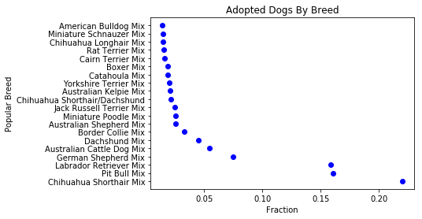

```python
import csv
import numpy as np
import pandas as pd
import matplotlib.pyplot as plt
```


```python
# Reading the file that contains the details of all the pets and their outcomes in the austin shelter homes.

animal_outcome = pd.read_csv("Austin_Animal_FY14_Outcomes.csv", encoding='cp1252')
animal_outcome = animal_outcome.reindex(columns = ['Animal ID', 'Name', 'Outcome Date', 'Outcome Time', 'Outcome Type',
                                                  'Outcome Subtype', 'Animal Type', 'Sex upon Outcome', 'Age upon Outcome',
                                                  'Breed', 'Color', 'Days upon Outcome'])
animal_outcome = animal_outcome[['Outcome Type', 'Animal Type', 'Breed', 'Days upon Outcome']]
animal_outcome.head()
```


<div>
<style>
    .dataframe thead tr:only-child th {
        text-align: right;
    }

    .dataframe thead th {
        text-align: left;
    }

    .dataframe tbody tr th {
        vertical-align: top;
    }
</style>
<table border="1" class="dataframe">
  <thead>
    <tr style="text-align: right;">
      <th></th>
      <th>Outcome Type</th>
      <th>Animal Type</th>
      <th>Breed</th>
      <th>Days upon Outcome</th>
    </tr>
  </thead>
  <tbody>
    <tr>
      <th>0</th>
      <td>Adoption</td>
      <td>Dog</td>
      <td>Labrador Retriever Mix</td>
      <td>60.0</td>
    </tr>
    <tr>
      <th>1</th>
      <td>Transfer</td>
      <td>Cat</td>
      <td>Domestic Shorthair Mix</td>
      <td>7.0</td>
    </tr>
    <tr>
      <th>2</th>
      <td>Transfer</td>
      <td>Cat</td>
      <td>Domestic Shorthair Mix</td>
      <td>7.0</td>
    </tr>
    <tr>
      <th>3</th>
      <td>Transfer</td>
      <td>Cat</td>
      <td>Domestic Shorthair Mix</td>
      <td>7.0</td>
    </tr>
    <tr>
      <th>4</th>
      <td>Return to Owner</td>
      <td>Dog</td>
      <td>Bulldog Mix</td>
      <td>1460.0</td>
    </tr>
  </tbody>
</table>
</div>


```python
# Creating the data frames with info regarding outcomes by breed

dogs_outcome_breed = dogs_outcome.groupby('Breed', as_index = False)['Animal Type'].count()
dogs_outcome_breed = dogs_outcome_breed.sort_values('Animal Type', ascending = False)
dogs_outcome_breed = dogs_outcome_breed.head(5)
dogs_outcome_breed

cats_outcome_breed = cats_outcome.groupby('Breed', as_index = False)['Animal Type'].count()
cats_outcome_breed = cats_outcome_breed.sort_values('Animal Type', ascending = False)
cats_outcome_breed = cats_outcome_breed.head(5)
cats_outcome_breed
```


<div>
<style>
    .dataframe thead tr:only-child th {
        text-align: right;
    }

    .dataframe thead th {
        text-align: left;
    }

    .dataframe tbody tr th {
        vertical-align: top;
    }
</style>
<table border="1" class="dataframe">
  <thead>
    <tr style="text-align: right;">
      <th></th>
      <th>Breed</th>
      <th>Animal Type</th>
    </tr>
  </thead>
  <tbody>
    <tr>
      <th>20</th>
      <td>Domestic Shorthair Mix</td>
      <td>5434</td>
    </tr>
    <tr>
      <th>17</th>
      <td>Domestic Medium Hair Mix</td>
      <td>581</td>
    </tr>
    <tr>
      <th>12</th>
      <td>Domestic Longhair Mix</td>
      <td>327</td>
    </tr>
    <tr>
      <th>42</th>
      <td>Siamese Mix</td>
      <td>229</td>
    </tr>
    <tr>
      <th>19</th>
      <td>Domestic Shorthair</td>
      <td>72</td>
    </tr>
  </tbody>
</table>
</div>


```python
# Finding total number of dogs and cats

dogs_outcome = animal_outcome[animal_outcome["Animal Type"] == 'Dog']
dogs_outcome = dogs_outcome.sort_values('Days upon Outcome')

total_dogs = dogs_outcome['Animal Type'].count()


cats_outcome = animal_outcome[animal_outcome["Animal Type"] == 'Cat']
cats_outcome = cats_outcome.sort_values('Days upon Outcome')

total_cats = cats_outcome['Animal Type'].count()

```


```python
#Finding the number of dogs/cats by each outcome type

dogs_adopted = dogs_outcome.loc[dogs_outcome['Outcome Type']=='Adoption']
dogs_euthanized = dogs_outcome.loc[dogs_outcome['Outcome Type']== 'Euthanasia']
dogs_died = dogs_outcome.loc[dogs_outcome['Outcome Type']== 'Died']
dogs_transfered = dogs_outcome.loc[dogs_outcome['Outcome Type']== 'Transfer']
dogs_returned = dogs_outcome.loc[dogs_outcome['Outcome Type']== 'Return to Owner']

cats_adopted = cats_outcome.loc[cats_outcome['Outcome Type']=='Adoption']
cats_euthanized = cats_outcome.loc[cats_outcome['Outcome Type']== 'Euthanasia']
cats_died = cats_outcome.loc[cats_outcome['Outcome Type']== 'Died']
cats_transfered = cats_outcome.loc[cats_outcome['Outcome Type']== 'Transfer']
cats_returned = cats_outcome.loc[cats_outcome['Outcome Type']== 'Return to Owner']
```


```python
#Finding the outcomes with respect to age

adopted_dogs_by_age = dogs_adopted.groupby('Days upon Outcome', as_index = False)['Animal Type'].count()
euthanized_dogs_by_age = dogs_euthanized.groupby('Days upon Outcome', as_index = False)['Animal Type'].count()
died_dogs_by_age = dogs_died.groupby('Days upon Outcome', as_index = False)['Animal Type'].count()
transfered_dogs_by_age = dogs_transfered.groupby('Days upon Outcome', as_index = False)['Animal Type'].count()
returned_dogs_by_age = dogs_returned.groupby('Days upon Outcome', as_index = False)['Animal Type'].count()

adopted_cats_by_age = cats_adopted.groupby('Days upon Outcome', as_index = False)['Animal Type'].count()
euthanized_cats_by_age = cats_euthanized.groupby('Days upon Outcome', as_index = False)['Animal Type'].count()
died_cats_by_age = cats_died.groupby('Days upon Outcome', as_index = False)['Animal Type'].count()
transfered_cats_by_age = cats_transfered.groupby('Days upon Outcome', as_index = False)['Animal Type'].count()
returned_cats_by_age = cats_returned.groupby('Days upon Outcome', as_index = False)['Animal Type'].count()
```


```python
# finding the number of dogs less than a month and greater than 11 years in age 

dogs_adopted_11year = adopted_dogs_by_age[adopted_dogs_by_age['Days upon Outcome'] > 4015 ]
yd1_0 = dogs_adopted_11year['Animal Type'].sum()
dogs_adopted_month = adopted_dogs_by_age[adopted_dogs_by_age['Days upon Outcome'] < 30]
yd1_00 = dogs_adopted_month['Animal Type'].sum()

dogs_euthanized_month = euthanized_dogs_by_age[euthanized_dogs_by_age['Days upon Outcome'] > 4015 ]
yd2_0 = dogs_adopted_month['Animal Type'].sum()
dogs_euthanized_month = euthanized_dogs_by_age[euthanized_dogs_by_age['Days upon Outcome'] < 30 ]
yd2_00 = dogs_adopted_month['Animal Type'].sum()

dogs_transfered_month = transfered_dogs_by_age[transfered_dogs_by_age['Days upon Outcome'] > 4015 ]
yd3_0 = dogs_transfered_month['Animal Type'].sum()
dogs_transfered_month = transfered_dogs_by_age[transfered_dogs_by_age['Days upon Outcome'] < 30 ]
yd3_00 = dogs_transfered_month['Animal Type'].sum()

dogs_died_month = died_dogs_by_age[died_dogs_by_age['Days upon Outcome'] > 4015 ]
yd4_0 = dogs_died_month['Animal Type'].sum()
dogs_died_month = died_dogs_by_age[died_dogs_by_age['Days upon Outcome'] < 30 ]
yd4_00 = dogs_died_month['Animal Type'].sum()

dogs_returned_month = returned_dogs_by_age[returned_dogs_by_age['Days upon Outcome'] > 4015]
yd5_0 = dogs_returned_month['Animal Type'].sum()
dogs_returned_month = returned_dogs_by_age[returned_dogs_by_age['Days upon Outcome'] < 30]
yd5_00 = dogs_returned_month['Animal Type'].sum()

```


```python
# Storing the values calculated above in variables

a = yd1_0
b = yd2_0
c = yd3_0
d = yd4_0
e = yd5_0
a0 = yd1_00
b0 = yd2_00
c0 = yd3_00
d0 = yd4_00
e0 = yd5_00
```


```python
# finding the number of dogs less than a month and greater than 11 years in age 

cats_adopted_11year = adopted_cats_by_age[adopted_cats_by_age['Days upon Outcome'] > 4015 ]
yc1_0 = cats_adopted_11year['Animal Type'].sum()
cats_adopted_month = adopted_cats_by_age[adopted_cats_by_age['Days upon Outcome'] < 30]
yc1_00 = cats_adopted_month['Animal Type'].sum()

cats_euthanized_month = euthanized_cats_by_age[euthanized_cats_by_age['Days upon Outcome'] > 4015 ]
yc2_0 = cats_adopted_month['Animal Type'].sum()
cats_euthanized_month = euthanized_cats_by_age[euthanized_cats_by_age['Days upon Outcome'] < 30 ]
yc2_00 = dogs_adopted_month['Animal Type'].sum()

cats_transfered_month = transfered_cats_by_age[transfered_cats_by_age['Days upon Outcome'] > 4015 ]
yc3_0 = cats_transfered_month['Animal Type'].sum()
cats_transfered_month = transfered_cats_by_age[transfered_cats_by_age['Days upon Outcome'] < 30 ]
yc3_00 = cats_transfered_month['Animal Type'].sum()

cats_died_month = died_cats_by_age[died_cats_by_age['Days upon Outcome'] > 4015 ]
yc4_0 = cats_died_month['Animal Type'].sum()
cats_died_month = died_cats_by_age[died_cats_by_age['Days upon Outcome'] < 30 ]
yc4_00 = cats_died_month['Animal Type'].sum()

cats_returned_month = returned_cats_by_age[returned_cats_by_age['Days upon Outcome'] > 4015]
yc5_0 = cats_returned_month['Animal Type'].sum()
cats_returned_month = returned_cats_by_age[returned_cats_by_age['Days upon Outcome'] < 30]
yc5_00 = cats_returned_month['Animal Type'].sum()
```


```python
# Storing the values calculated above in variables

p = yd1_0
q = yd2_0
r = yd3_0
s = yd4_0
t = yd5_0
p0 = yd1_00
q0 = yd2_00
r0 = yd3_00
s0 = yd4_00
t0 = yd5_00
```


```python
# Creating Data frames for animal between ages 1 month and 1 years

adopted_dogs_by_age = adopted_dogs_by_age[adopted_dogs_by_age['Days upon Outcome']<4380]
euthanized_dogs_by_age = euthanized_dogs_by_age[euthanized_dogs_by_age['Days upon Outcome']<4380]
euthanized_dogs_by_age = euthanized_dogs_by_age[euthanized_dogs_by_age['Days upon Outcome']> 30]
died_dogs_by_age = died_dogs_by_age[died_dogs_by_age['Days upon Outcome']<4380]
died_dogs_by_age = died_dogs_by_age[died_dogs_by_age['Days upon Outcome']>30]
transfered_dogs_by_age = transfered_dogs_by_age[transfered_dogs_by_age['Days upon Outcome']<4380]
transfered_dogs_by_age = transfered_dogs_by_age[transfered_dogs_by_age['Days upon Outcome']>30]
returned_dogs_by_age = returned_dogs_by_age[returned_dogs_by_age['Days upon Outcome']<4380]
returned_dogs_by_age = returned_dogs_by_age[returned_dogs_by_age['Days upon Outcome']>30]

adopted_dogs_by_age.set_index(['Days upon Outcome'], inplace = True)
euthanized_dogs_by_age.set_index(['Days upon Outcome'], inplace = True)
died_dogs_by_age.set_index(['Days upon Outcome'], inplace = True)
transfered_dogs_by_age.set_index(['Days upon Outcome'], inplace = True)
returned_dogs_by_age.set_index(['Days upon Outcome'], inplace = True)
```


```python
# Creating Data frames for animal between ages 1 month and 1 years

adopted_cats_by_age = adopted_cats_by_age[adopted_cats_by_age['Days upon Outcome']<4380]
euthanized_cats_by_age = euthanized_cats_by_age[euthanized_cats_by_age['Days upon Outcome']<4380]
euthanized_cats_by_age = euthanized_cats_by_age[euthanized_cats_by_age['Days upon Outcome']> 30]
died_cats_by_age = died_cats_by_age[died_cats_by_age['Days upon Outcome']<4380]
died_cats_by_age = died_cats_by_age[died_cats_by_age['Days upon Outcome']>30]
transfered_cats_by_age = transfered_cats_by_age[transfered_cats_by_age['Days upon Outcome']<4380]
transfered_cats_by_age = transfered_cats_by_age[transfered_cats_by_age['Days upon Outcome']>30]
returned_cats_by_age = returned_cats_by_age[returned_cats_by_age['Days upon Outcome']<4380]
returned_cats_by_age = returned_cats_by_age[returned_cats_by_age['Days upon Outcome']>30]

adopted_cats_by_age.set_index(['Days upon Outcome'], inplace = True)
euthanized_cats_by_age.set_index(['Days upon Outcome'], inplace = True)
died_cats_by_age.set_index(['Days upon Outcome'], inplace = True)
transfered_cats_by_age.set_index(['Days upon Outcome'], inplace = True)
returned_cats_by_age.set_index(['Days upon Outcome'], inplace = True)
```


```python
adopted_dogs_by_age.columns = ['Adopted']
transfered_dogs_by_age.columns = ['Transfered']
returned_dogs_by_age.columns = ['Returned']
euthanized_dogs_by_age.columns = ['Euthanasia']
died_dogs_by_age.columns = ['Died']
```


```python
adopted_cats_by_age.columns = ['Adopted']
transfered_cats_by_age.columns = ['Transfered']
returned_cats_by_age.columns = ['Returned']
euthanized_cats_by_age.columns = ['Euthanasia']
died_cats_by_age.columns = ['Died']
```


```python
# creating final df for outcome of dogs and their outcomes with respect to age

result_dogs = pd.concat([adopted_dogs_by_age, euthanized_dogs_by_age, died_dogs_by_age, transfered_dogs_by_age,returned_dogs_by_age],
                  axis = 1, join = 'outer')
result_dogs.loc[-1] =[a,b,c,d,e]
data = []
data.insert(0, {'Adopted': a0, 'Euthanasia':b0, 'Transfered': c0, 'Died': d0, 'Returned': e0})
result_dogs = pd.concat([pd.DataFrame(data), result_dogs])
result_dogs = result_dogs.replace(np.nan , 0)
result_dogs = result_dogs.drop(result_dogs.index[2])
result_dogs['sum'] = result_dogs.sum(axis=1)

result_dogs = result_dogs.loc[:,'Adopted': 'Transfered'].div(result_dogs['sum'], axis = 0)
result_dogs = result_dogs*100
```


```python
# creating final df for outcome of cats and their outcomes with respect to age

result_cats = pd.concat([adopted_cats_by_age, euthanized_cats_by_age, died_cats_by_age, transfered_cats_by_age,returned_cats_by_age],
                  axis = 1, join = 'outer')
result_cats.loc[-1] =[p,q,r,s,t]
data_cats = []
data_cats.insert(0, {'Adopted': p0, 'Euthanasia':q0, 'Transfered': r0, 'Died': s0, 'Returned': t0})
result_cats = pd.concat([pd.DataFrame(data_cats), result_cats])
result_cats = result_cats.replace(np.nan , 0)
result_cats = result_cats.drop(result_dogs.index[2])
result_cats['sum'] = result_cats.sum(axis=1)

result_cats = result_cats.loc[:,'Adopted': 'Transfered'].div(result_cats['sum'], axis = 0)
result_cats = result_cats*100
```


```python
x = [0, 30, 60, 90, 120, 150, 180, 210, 240, 270, 300, 330, 365, 730, 1095, 1460, 1825, 2190, 2555, 2920, 3285, 3650, 4015, -1]
labels = ['< month','1 month', '2 month', '3 month', '4 month', '5 month','6 month', '7 month', '8month', '9month', '10 month',
                       '11 month', '1 year', '2 year', '3 year', '4 year', '5 year', '6 year', '7 year', '8 year',
                       '9 year', '10 year', '11year', '> 11 year']
```


```python
# plot of relative outcome type vs age of animal

ind = np.arange(len(x))
width = 0.5
p1 = plt.bar(ind, result_dogs['Adopted'], width, color = 'steelblue', label = "Adopted")
p2 = plt.bar(ind, result_dogs['Euthanasia'], width, color = 'orange', label = "Euthanasia", 
             bottom = result_dogs['Adopted'])
p3 = plt.bar(ind, result_dogs['Transfered'], width, color = 'red', label = "Transfered", 
             bottom = result_dogs['Adopted']+result_dogs['Euthanasia'])
p4 = plt.bar(ind, result_dogs['Died'], width, color = 'limegreen', label = "Died", 
             bottom = result_dogs['Adopted']+result_dogs['Euthanasia']+result_dogs['Transfered'])
p5 = plt.bar(ind, result_dogs['Returned'], width, color = 'mediumpurple', label = "Returned",
             bottom=result_dogs['Adopted']+result_dogs['Euthanasia']+result_dogs['Transfered']+result_dogs['Died'])
plt.xticks(ind, labels, rotation = 'vertical')
plt.ylabel("Relative Count by Outcome")
plt.legend(loc="upper right")
plt.title("Outcome Type by Age Upon Outcome - Dogs")
plt.show()
```


```python
ind = np.arange(len(x))
width = 0.5
p1 = plt.bar(ind, result_cats['Adopted'], width, color = 'steelblue', label = "Adopted")
p2 = plt.bar(ind, result_cats['Euthanasia'], width, color = 'orange', label = "Euthanasia", 
             bottom = result_cats['Adopted'])
p3 = plt.bar(ind, result_cats['Transfered'], width, color = 'red', label = "Transfered", 
             bottom = result_cats['Adopted']+result_cats['Euthanasia'])
p4 = plt.bar(ind, result_cats['Died'], width, color = 'limegreen', label = "Died", 
             bottom = result_cats['Adopted']+result_cats['Euthanasia']+result_cats['Transfered'])
p5 = plt.bar(ind, result_cats['Returned'], width, color = 'mediumpurple', label = "Returned",
             bottom=result_cats['Adopted']+result_cats['Euthanasia']+result_cats['Transfered']+result_cats['Died'])
plt.xticks(ind, labels, rotation = 'vertical')
plt.ylabel("Relative Count by Outcome")
plt.legend(loc="upper right")
plt.title("Outcome Type by Age Upon Outcome - Cats")
plt.show()
```


```python
#analysis of popular breeds by outcome
#taking five popular breed and studying their outcomes

adopted_pitbull = dogs_adopted.loc[dogs_adopted['Breed'] == 'Pit Bull Mix']['Animal Type'].count()
euthanized_pitbull = dogs_euthanized.loc[dogs_euthanized['Breed'] == 'Pit Bull Mix']['Animal Type'].count()
transfered_pitbull = dogs_transfered.loc[dogs_transfered['Breed'] == 'Pit Bull Mix']['Animal Type'].count()
died_pitbull = dogs_died.loc[dogs_died['Breed'] == 'Pit Bull Mix']['Animal Type'].count()
returned_pitbull = dogs_returned.loc[dogs_returned['Breed'] == 'Pit Bull Mix']['Animal Type'].count()

adopted_Chihuahua = dogs_adopted.loc[dogs_adopted['Breed'] == 'Chihuahua Shorthair Mix']['Animal Type'].count()
euthanized_Chihuahua = dogs_euthanized.loc[dogs_euthanized['Breed'] == 'Chihuahua Shorthair Mix']['Animal Type'].count()
transfered_Chihuahua = dogs_transfered.loc[dogs_transfered['Breed'] == 'Chihuahua Shorthair Mix']['Animal Type'].count()
died_Chihuahua = dogs_died.loc[dogs_died['Breed'] == 'Chihuahua Shorthair Mix']['Animal Type'].count()
returned_Chihuahua = dogs_returned.loc[dogs_returned['Breed'] == 'Chihuahua Shorthair Mix']['Animal Type'].count()

adopted_Labrador = dogs_adopted.loc[dogs_adopted['Breed'] == 'Labrador Retriever Mix']['Animal Type'].count()
euthanized_Labrador = dogs_euthanized.loc[dogs_euthanized['Breed'] == 'Labrador Retriever Mix']['Animal Type'].count()
transfered_Labrador = dogs_transfered.loc[dogs_transfered['Breed'] == 'Labrador Retriever Mix']['Animal Type'].count()
died_Labrador = dogs_died.loc[dogs_died['Breed'] == 'Labrador Retriever Mix']['Animal Type'].count()
returned_Labrador = dogs_returned.loc[dogs_returned['Breed'] == 'Labrador Retriever Mix']['Animal Type'].count()

adopted_GS = dogs_adopted.loc[dogs_adopted['Breed'] == 'German Shepherd Mix']['Animal Type'].count()
euthanized_GS = dogs_euthanized.loc[dogs_euthanized['Breed'] == 'German Shepherd Mix']['Animal Type'].count()
transfered_GS = dogs_transfered.loc[dogs_transfered['Breed'] == 'German Shepherd Mix']['Animal Type'].count()
died_GS = dogs_died.loc[dogs_died['Breed'] == 'German Shepherd Mix']['Animal Type'].count()
returned_GS = dogs_returned.loc[dogs_returned['Breed'] == 'German Shepherd Mix']['Animal Type'].count()

adopted_AD = dogs_adopted.loc[dogs_adopted['Breed'] == 'Australian Cattle Dog Mix']['Animal Type'].count()
euthanized_AD = dogs_euthanized.loc[dogs_euthanized['Breed'] == 'Australian Cattle Dog Mix']['Animal Type'].count()
transfered_AD = dogs_transfered.loc[dogs_transfered['Breed'] == 'Australian Cattle Dog Mix']['Animal Type'].count()
died_AD = dogs_died.loc[dogs_died['Breed'] == 'Australian Cattle Dog Mix']['Animal Type'].count()
returned_AD = dogs_returned.loc[dogs_returned['Breed'] == 'Australian Cattle Dog Mix']['Animal Type'].count()
```


```python
adopted = (adopted_pitbull, adopted_Chihuahua, adopted_Labrador, adopted_GS, adopted_AD)
euthanized = (euthanized_pitbull, euthanized_Chihuahua, euthanized_Labrador, euthanized_GS, euthanized_AD)
transfered = (transfered_pitbull, transfered_Chihuahua, transfered_Labrador, transfered_GS, transfered_AD)
died = (died_pitbull, died_Chihuahua, died_Labrador, died_GS, died_AD)
returned = (returned_pitbull, returned_Chihuahua, returned_Labrador, returned_GS, returned_AD)
```


```python
df = pd.DataFrame({'adopted':adopted, 'euthanized':euthanized,
                   'transfered':transfered, 'died':died, 'returned':returned})
for i in range(0,5):
    df.iloc[i] = (df.iloc[i]/df.iloc[i].sum())*100
```


```python
N = 5
ind = np.arange(N)
labels = ('Pitbull', 'Chihuahua', 'Labrador', 'German Shepherd', 'Australian Dog')
df.plot.bar(stacked = True)
plt.xticks(ind, labels)
plt.legend(loc="upper right")
plt.show()
```


```python
adopted_breed = dogs_adopted.groupby('Breed', as_index = False)['Animal Type'].count()
adopted_breed = adopted_breed.sort_values('Animal Type', ascending = False)
adopted_breed = adopted_breed.head(20)
total_adopted = adopted_breed['Animal Type'].sum()
adopted_breed
```


<div>
<style>
    .dataframe thead tr:only-child th {
        text-align: right;
    }

    .dataframe thead th {
        text-align: left;
    }

    .dataframe tbody tr th {
        vertical-align: top;
    }
</style>
<table border="1" class="dataframe">
  <thead>
    <tr style="text-align: right;">
      <th></th>
      <th>Breed</th>
      <th>Animal Type</th>
    </tr>
  </thead>
  <tbody>
    <tr>
      <th>236</th>
      <td>Chihuahua Shorthair Mix</td>
      <td>517</td>
    </tr>
    <tr>
      <th>547</th>
      <td>Pit Bull Mix</td>
      <td>377</td>
    </tr>
    <tr>
      <th>433</th>
      <td>Labrador Retriever Mix</td>
      <td>373</td>
    </tr>
    <tr>
      <th>357</th>
      <td>German Shepherd Mix</td>
      <td>176</td>
    </tr>
    <tr>
      <th>34</th>
      <td>Australian Cattle Dog Mix</td>
      <td>129</td>
    </tr>
    <tr>
      <th>293</th>
      <td>Dachshund Mix</td>
      <td>107</td>
    </tr>
    <tr>
      <th>131</th>
      <td>Border Collie Mix</td>
      <td>77</td>
    </tr>
    <tr>
      <th>66</th>
      <td>Australian Shepherd Mix</td>
      <td>61</td>
    </tr>
    <tr>
      <th>503</th>
      <td>Miniature Poodle Mix</td>
      <td>60</td>
    </tr>
    <tr>
      <th>416</th>
      <td>Jack Russell Terrier Mix</td>
      <td>58</td>
    </tr>
    <tr>
      <th>246</th>
      <td>Chihuahua Shorthair/Dachshund</td>
      <td>51</td>
    </tr>
    <tr>
      <th>57</th>
      <td>Australian Kelpie Mix</td>
      <td>49</td>
    </tr>
    <tr>
      <th>696</th>
      <td>Yorkshire Terrier Mix</td>
      <td>47</td>
    </tr>
    <tr>
      <th>215</th>
      <td>Catahoula Mix</td>
      <td>45</td>
    </tr>
    <tr>
      <th>161</th>
      <td>Boxer Mix</td>
      <td>45</td>
    </tr>
    <tr>
      <th>191</th>
      <td>Cairn Terrier Mix</td>
      <td>38</td>
    </tr>
    <tr>
      <th>598</th>
      <td>Rat Terrier Mix</td>
      <td>37</td>
    </tr>
    <tr>
      <th>229</th>
      <td>Chihuahua Longhair Mix</td>
      <td>35</td>
    </tr>
    <tr>
      <th>512</th>
      <td>Miniature Schnauzer Mix</td>
      <td>35</td>
    </tr>
    <tr>
      <th>13</th>
      <td>American Bulldog Mix</td>
      <td>34</td>
    </tr>
  </tbody>
</table>
</div>


```python
n = list(adopted_breed['Animal Type'])
d_names = list(adopted_breed['Breed'])
d_ratios=[]
for i in range(0, len(n)):
    d_ratios.append(n[i]/total_adopted)
```


```python
ind = np.arange(20)
d_plot = plt.plot(d_ratios,ind, 'bo')
plt.title('Adoption Rate By Breed - Dogs')
plt.yticks(ind, d_names)
plt.xlabel('Fraction')
plt.ylabel('Popular Breed')
plt.show()
```





```python
adopted_DSM = cats_adopted.loc[cats_adopted['Breed'] == 'Domestic Shorthair Mix']['Animal Type'].count()
euthanized_DSM = cats_euthanized.loc[cats_euthanized['Breed'] == 'Domestic Shorthair Mix']['Animal Type'].count()
transfered_DSM = cats_transfered.loc[cats_transfered['Breed'] == 'Domestic Shorthair Mix']['Animal Type'].count()
died_DSM = cats_died.loc[cats_died['Breed'] == 'Domestic Shorthair Mix']['Animal Type'].count()
returned_DSM = cats_returned.loc[cats_returned['Breed'] == 'Domestic Shorthair Mix']['Animal Type'].count()

adopted_DM = cats_adopted.loc[cats_adopted['Breed'] == 'Domestic Medium Hair Mix']['Animal Type'].count()
euthanized_DM = cats_euthanized.loc[cats_euthanized['Breed'] == 'Domestic Medium Hair Mix']['Animal Type'].count()
transfered_DM = cats_transfered.loc[cats_transfered['Breed'] == 'Domestic Medium Hair Mix']['Animal Type'].count()
died_DM = cats_died.loc[cats_died['Breed'] == 'Domestic Medium Hair Mix']['Animal Type'].count()
returned_DM = cats_returned.loc[cats_returned['Breed'] == 'Domestic Medium Hair Mix']['Animal Type'].count()

adopted_DLM = cats_adopted.loc[cats_adopted['Breed'] == 'Domestic longhair Mix']['Animal Type'].count()
euthanized_DLM = cats_euthanized.loc[cats_euthanized['Breed'] == 'Domestic longhair Mix']['Animal Type'].count()
transfered_DLM = cats_transfered.loc[cats_transfered['Breed'] == 'Domestic longhair Mix']['Animal Type'].count()
died_DLM = cats_died.loc[cats_died['Breed'] == 'Domestic longhair Mix']['Animal Type'].count()
returned_DLM = cats_returned.loc[cats_returned['Breed'] == 'Domestic longhair Mix']['Animal Type'].count()

adopted_SM = cats_adopted.loc[cats_adopted['Breed'] == 'Siamese Mix']['Animal Type'].count()
euthanized_SM = cats_euthanized.loc[cats_euthanized['Breed'] == 'Siamese Mix']['Animal Type'].count()
transfered_SM = cats_transfered.loc[cats_transfered['Breed'] == 'Siamese Mix']['Animal Type'].count()
died_SM = cats_died.loc[cats_died['Breed'] == 'Siamese Mix']['Animal Type'].count()
returned_SM = cats_returned.loc[cats_returned['Breed'] == 'Siamese Mix']['Animal Type'].count()

adopted_SH = cats_adopted.loc[cats_adopted['Breed'] == 'Domestic Shorthair']['Animal Type'].count()
euthanized_SH = cats_euthanized.loc[cats_euthanized['Breed'] == 'Domestic Shorthair']['Animal Type'].count()
transfered_SH = cats_transfered.loc[cats_transfered['Breed'] == 'Domestic Shorthair']['Animal Type'].count()
died_SH = cats_died.loc[cats_died['Breed'] == 'Domestic Shorthair']['Animal Type'].count()
returned_SH = cats_returned.loc[cats_returned['Breed'] == 'Domestic Shorthair']['Animal Type'].count()
```


```python
c_adopted = (adopted_DSM, adopted_DM, adopted_DLM, adopted_SM, adopted_SH)
c_euthanized = (euthanized_DSM, euthanized_DM, euthanized_DLM, euthanized_SM, euthanized_SH)
c_transfered = (transfered_DSM, transfered_DM, transfered_DLM, transfered_SM, transfered_SH)
c_died = (died_DSM, died_DM, died_DLM, died_SM, died_SH)
c_returned = (returned_DSM, returned_DM, returned_DLM, returned_SM, returned_SH)
```


```python
c_df = pd.DataFrame({'adopted':c_adopted, 'euthanized':c_euthanized,
                   'transfered':c_transfered, 'died':c_died, 'returned':c_returned})
for i in range(0,5):
    df.iloc[i] = (df.iloc[i]/df.iloc[i].sum())*100
```


```python
N = 5
ind = np.arange(N)
labels = ('Domestic Shorthair Mix', 'Domestic Medium Hair Mix', 'Domestic Longhair Mix', 'Siamese Mix', 'Domestic Short Hair')
df.plot.bar(stacked = True)
plt.xticks(ind, labels)
plt.legend(loc="upper right")
plt.show()
```


```python
c_adopted_breed = cats_adopted.groupby('Breed', as_index = False)['Animal Type'].count()
c_adopted_breed = c_adopted_breed.sort_values('Animal Type', ascending = False)
c_adopted_breed = c_adopted_breed.head(20)
c_total_adopted = c_adopted_breed['Animal Type'].sum()
c_adopted_breed
```


<div>
<style>
    .dataframe thead tr:only-child th {
        text-align: right;
    }

    .dataframe thead th {
        text-align: left;
    }

    .dataframe tbody tr th {
        vertical-align: top;
    }
</style>
<table border="1" class="dataframe">
  <thead>
    <tr style="text-align: right;">
      <th></th>
      <th>Breed</th>
      <th>Animal Type</th>
    </tr>
  </thead>
  <tbody>
    <tr>
      <th>14</th>
      <td>Domestic Shorthair Mix</td>
      <td>1995</td>
    </tr>
    <tr>
      <th>12</th>
      <td>Domestic Medium Hair Mix</td>
      <td>236</td>
    </tr>
    <tr>
      <th>9</th>
      <td>Domestic Longhair Mix</td>
      <td>130</td>
    </tr>
    <tr>
      <th>31</th>
      <td>Siamese Mix</td>
      <td>108</td>
    </tr>
    <tr>
      <th>34</th>
      <td>Snowshoe Mix</td>
      <td>29</td>
    </tr>
    <tr>
      <th>13</th>
      <td>Domestic Shorthair</td>
      <td>25</td>
    </tr>
    <tr>
      <th>20</th>
      <td>Maine Coon Mix</td>
      <td>24</td>
    </tr>
    <tr>
      <th>21</th>
      <td>Manx Mix</td>
      <td>21</td>
    </tr>
    <tr>
      <th>29</th>
      <td>Russian Blue Mix</td>
      <td>14</td>
    </tr>
    <tr>
      <th>30</th>
      <td>Siamese</td>
      <td>12</td>
    </tr>
    <tr>
      <th>8</th>
      <td>Domestic Longhair</td>
      <td>9</td>
    </tr>
    <tr>
      <th>11</th>
      <td>Domestic Medium Hair</td>
      <td>9</td>
    </tr>
    <tr>
      <th>1</th>
      <td>Angora Mix</td>
      <td>6</td>
    </tr>
    <tr>
      <th>32</th>
      <td>Siamese/Domestic Shorthair</td>
      <td>6</td>
    </tr>
    <tr>
      <th>10</th>
      <td>Domestic Longhair/Persian</td>
      <td>3</td>
    </tr>
    <tr>
      <th>27</th>
      <td>Ragdoll Mix</td>
      <td>3</td>
    </tr>
    <tr>
      <th>25</th>
      <td>Persian Mix</td>
      <td>3</td>
    </tr>
    <tr>
      <th>33</th>
      <td>Snowshoe</td>
      <td>3</td>
    </tr>
    <tr>
      <th>18</th>
      <td>Japanese Bobtail Mix</td>
      <td>2</td>
    </tr>
    <tr>
      <th>36</th>
      <td>Tonkinese Mix</td>
      <td>2</td>
    </tr>
  </tbody>
</table>
</div>


```python
n = list(c_adopted_breed['Animal Type'])
c_names = list(c_adopted_breed['Breed'])
```


```python
c_ratios=[]
for i in range(0, len(n)):
    c_ratios.append(n[i]/c_total_adopted)
```


```python
ind = np.arange(20)
c_plot = plt.plot(c_ratios,ind, 'bo')
plt.title('Adoption Rate By Breed - Cats')
plt.xlabel('Fraction')
plt.ylabel('Popular Breed')
plt.yticks(ind, c_names)
plt.show()
```


```python

```
